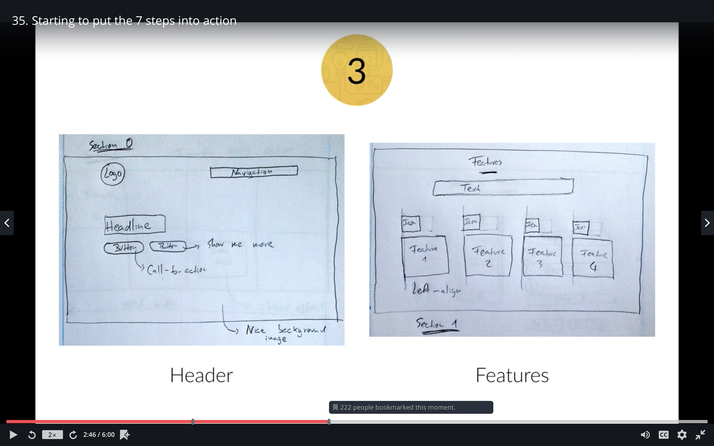
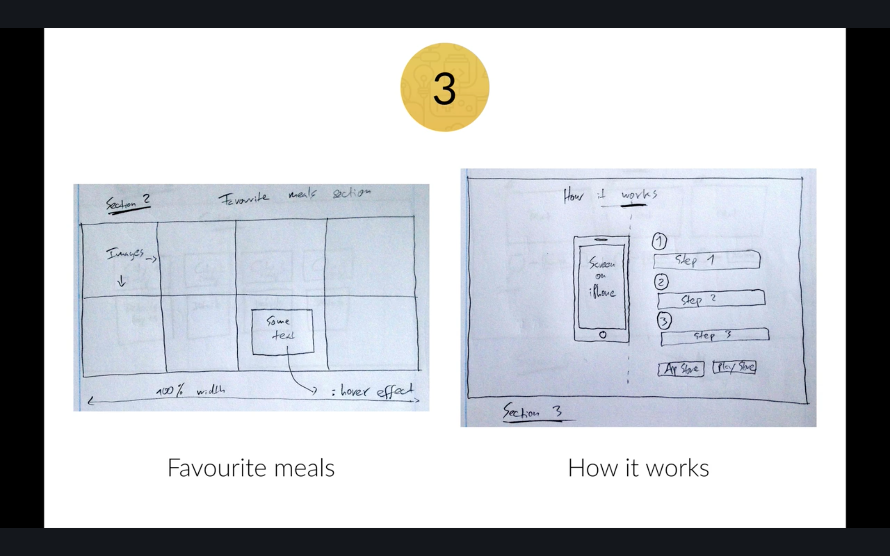
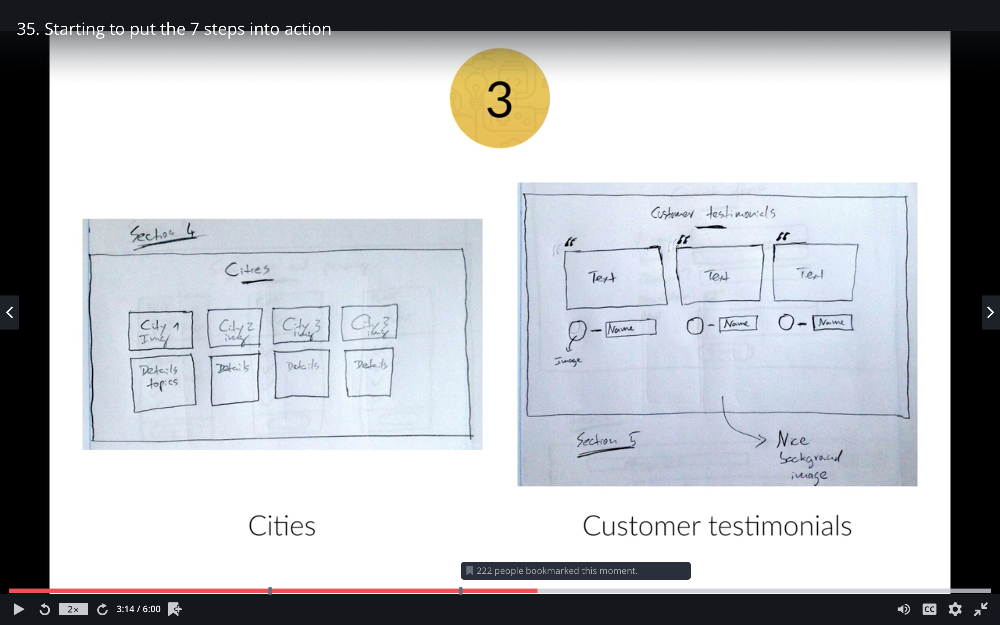
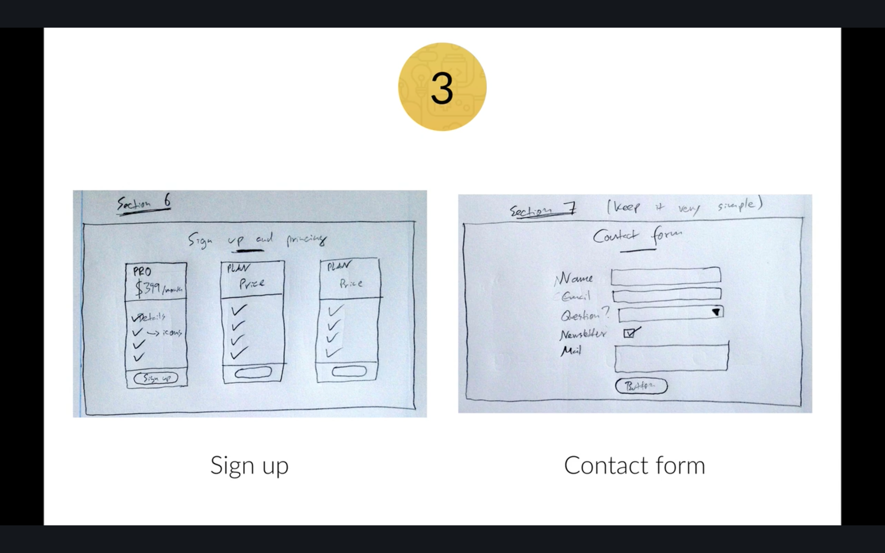
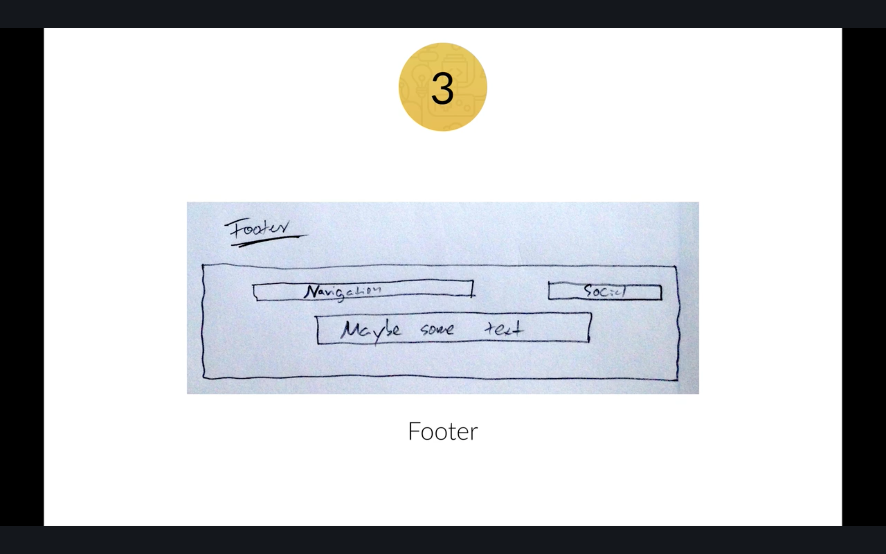

# Omnifood 

## 目次　(Table of Contents)
- [Omnifood](#omnifood)
  - [目次　(Table of Contents)](#%e7%9b%ae%e6%ac%a1-table-of-contents)
  - [What is this?](#what-is-this)
  - [Live Demo](#live-demo)
  - [Project Structure](#project-structure)
  - [Features](#features)
  - [Requirements?](#requirements)
  - [Installation](#installation)
  - [Run Application and start development Server](#run-application-and-start-development-server)
  - [Run Tests](#run-tests)
  - [Build Application for Deployment](#build-application-for-deployment)

---

## What is this?
jquery css html food delivery site example

## Live Demo

<!-- Live Demoは[こちらから](https://master.d3phb5yfhxhh0o.amplifyapp.com/) -->

## Project Structure
ソースの構成は以下となります：
<pre>
|- src                       プロジェクトのソースコード　project source code
|  |- css/                   cssディレクトリ　css directory
|  |- data/                  静的データディレクトリ　static data directory
|  |- img/                   画像ディレクトリ　img directory
|  |- js/                    jsディレクトリ　js directory
|- task-docs                 プロジェクトの以来ディレクトリ　project task dir
|  |- Omnifood Contents      要件とウェブの仕様  web specifications
|  |- sketches               サイトの下書き　the early sketches for the whole website
|- vendors                   ライブラリーのソースコード library source code
|  |- css                    css ライブラリーディレクトリー css library directory
|  |- fonts                  font ライブラリーディレクトリー font library directory
|  |- js                     js ライブラリーディレクトリー js library directory
|- index.html                htmlエントリポイント html entry point


</pre>

## Features
使用しているライブラリ
- Jquery
- CSS normalize: resetting css for standardized look 
- CSS grid 


## Requirements?
- 特になし

## Installation
- 特になし

## Run Application and start development Server
index.html のファイルをブラウザーにドラッグする

## Run Tests
 今のところはテストなし

## Build Application for Deployment
 既にスタティックファイルなのでデプロイコマンド不要

## 7 steps in making the site
1. Define your project
```
* Explanation:
Start off by defining the goal of your project. This can be showing your portfolio to the world, selling an e-book, building a blog, etc.
Also define your audience. Ask yourself: which is the typical user that will visit my website?
This is important, because you should always design with your goal and audience in mind.

* Goal
Show:
    1. what omnifood does
    2. cities it operates
    3. how it works
    4. form for subscription plan

Audience:
    People who don't cook
```
2. Plan out everything
```
* Explanation:
Once your project is defined, plan your content carefully. This includes text, images, videos, icons, etc.
Remember what I told you about visual hierarchy. It plays an important role when you start thinking about what you want on your website and what you don't. Defining the content before actually starting the design is called the content-first approach. It means that you should design for the content, instead of designing a webpage and then filling it with some stuff.
Define the navigation.
Define the site structure. You can draw a sitemap in this step if we're talking about a bigger project.

* Content
    Provided by omnifood in form of a text document and couple of image. Refer the task-docs.

* Navigation
    Also provide by omnifood in a text doc. Refer the task-docs.
```

3. Sketch your ideas before you design
```
* Explanation:
Now it's time to get inspired and think about your design.
Then, get the ideas out of your head. And with that I mean that you should sketch your ideas before you start designing. It will help you explore ideas and create a concept of what you want to build. Using pencil and paper is a great way of quickly retaining your valuable ideas.
Make as many sketches as you want, but don't spend too much time perfecting anything. Once you have an initial idea, you can concentrate on the details when designing in HTML and CSS.
I advise you to never, ever start designing without having an idea of what you want to build. Getting inspiration is very important in this phase, and I already told you how to do that!
```






4. Design and develop your website
```
* Explanation:
After sketching, start to design your website using all the guidelines and tips you've learned in the web design section.
You'll do that using HTML and CSS, which is called designing in the browser. Designing in the browser is basically designing and developing at the same time.
There are more and more designers leaving traditional design programs such as Photoshop and start designing in the browser. The biggest reason for this is that you can't design responsive websites in photoshop. It also saves you tons of time.
In this phase, you'll use your sketches, content and planning decisions you've made in steps 1, 2 and 3.

* Color:
    Orange

* Font:
    LATO

```
5. It's not done yet: optimization
```
Before you can actually launch your beautiful masterpiece for the world to see it, we have to optimize its performance in terms of site speed.
You also need to do some basic search engine optimization (SEO) for search engines such as google.
```
6. Launch the masterpiece
```
Your optimized website is now finally ready to launch.
All you need for launching is a webserver that will host your website and deliver it to the world.
```
7. Site maintenance
```
The launch of your website is not the end of the story.
Now it's time to monitor your users' behavior and make some changes to your website if necessary.
You should also update your content regularly in order to show your users that your website is alive! For instance, a blog can be a great way of doing that.
```